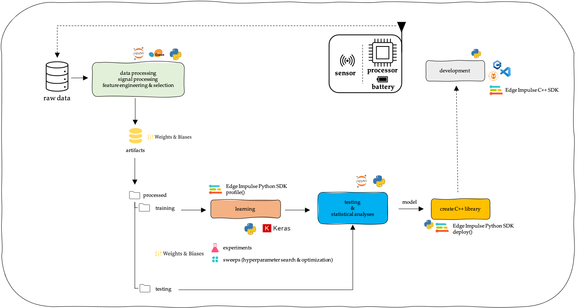
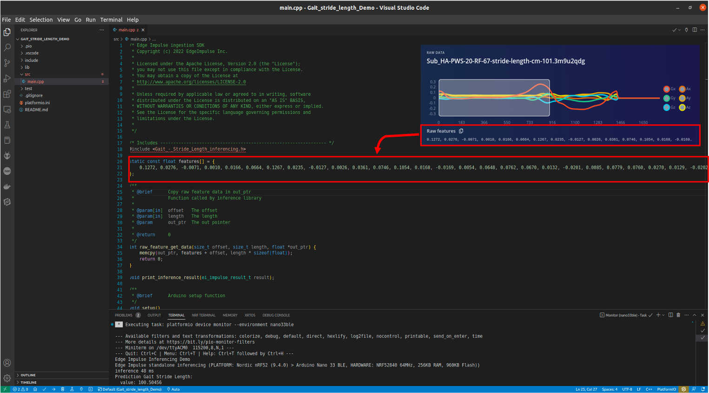

# Gait Stride Length Estimation - Embedded Machine Learning

<span style="color:red">**!!IMPORTANT!!** This repo is **under construction** and will be updated regularly.</span>.

This repo  contains a collection of (template) Jupyter Notebooks and Python scripts. It is related to the project Machine Learning at the Extreme Edge ([ML@E2dge](https://mlate2dge.github.io)). The project Machine Learning at the Extreme Edge (ML@E2dge) looks at how we can apply machine learning in the development of accurate, energy-efficient, and intelligent (wireless) (battery-powered) devices. The primary focus in the project lies on the machine learning part, the design of a regression model, given a healthcare case study (Gait Stride Length Estimation) as the backbone. 

## Gait Stride Length Estimation

Spatiotemporal gait parameters, e.g., gait stride length, are measurements from gait analysis. Today, different solutions are available for gait assessment outside the laboratory, specifically for spatiotemporal gait parameters. Such solutions are wearable devices that comprise an inertial measurement unit, IMU and a microcontroller, MCU. However, these existing wearable devices are resource constrained. They contain a processing unit with limited processing and memory capabilities, which limit the use of machine learning to estimate spatiotemporal gait parameters directly on the device. The solution is embedded machine learning or tiny machine learning (tinyML™).

## Datasets

- <a href="https://www.mdpi.com/2306-5729/6/9/95">TRIPOD — A Treadmill Walking Dataset with IMU, Pressure-Distribution and Photoelectric Data for Gait Analysis.</a> Justin Trautmann; Lin Zhou; Clemens Markus Brahms; Can Tunca; Cem Ersoy; Urs Granacher and Bert Arnrich.

- <a href="https://zenodo.org/record/7415759">DUO-GAIT: A Gait Dataset for Walking under Dual-Task and Fatigue Conditions with Inertial Measurement Units.</a> Zhou, Lin; Fischer; Eric; Brahms, Markus Clemens; Granacher, Urs; Arnrich, Bert

- Xsens - GAITRite dataset (private dataset).  Additional Xsens IMU data is collected in a gait laboratory (a written request to a Medical Ethics Committee is approved).

## Machine Learning Workflow

In the machine-learning workflow, we use open-source software (e.g. Python, scikit-learn, TensorFlow/Keras) and MLOps (Machine Learning Operations) frameworks [Edge Impulse Studio](https://www.edgeimpulse.com/) and [Weights and Biases](https://wandb.ai/).



## Embedded hardware

The selected embedded platform used for evaluation is the [SparkFun MicroMod with nRF52840 Processor mounted](https://www.sparkfun.com/products/16984) on a [SparkFun MicroMod Data Logging Carrier board](https://www.sparkfun.com/products/16829). The nRF52840 is an Arm® Cortex®-M4F 64 MHz processor from Nordic Semiconductor, with 1MB internal flash and 256kB internal RAM. The static buffer example from [Edge Impulse Ingestion SDK - Arduino ](https://docs.edgeimpulse.com/docs/deployment/arduino-library) is used to test the model on the device. As IDE, we use [Visual Studio Code](https://code.visualstudio.com/) (VSCode) with [PlatformIO](https://platformio.org/) IDE for VSCode.



## Project structure


```
├── src
│   └── profiling_and_deploy    <- source code
```

Reference: [(Cookiecutter) Data Science](https://github.com/drivendata/cookiecutter-data-science)

## Environment Setup

- Create environment: 

```
$ conda env create -f conda.yaml
```

- Activate environment:./pr 

```
$ conda activate gsl_model
```

- Update environment:

```
$ conda env update --name gsl_model --file conda.yaml
```
